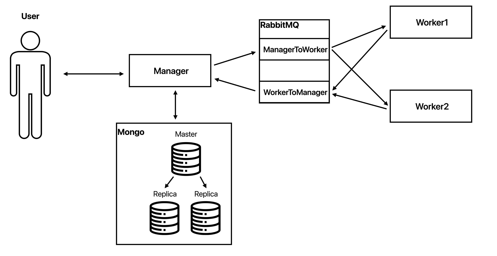

# Задача

Требовалось реализовать распределенную систему для взлома хэша под кодовым именем CrackHash. 
Непосредственно взлом хэша будем реализовывать через простой перебор словаря сгенерированного на основе алфавита (brute-force).
В общих чертах система должна работать по следующей логике:

1. В рамках системы существует менеджер, который принимает от пользователя запрос, содержащий MD-5 хэш некоторого слова, а также его максимальную длину.
2. Менеджер обрабатывает запрос: генерирует задачи в соответствии с заданным числом воркеров (вычислительных узлов) на перебор слов составленных из переданного им алфавита. После чего отправляет их на исполнение воркерам.
3. Каждый воркер принимает задачу, перебирает слова в заданном диапазоне и вычисляет их хэш. Находит слова у которых хеш совпадает с заданным, и результат работы возвращает менеджеру через очередь.

## Основные требования:
1. **Обеспечить сохранность данных при отказе работы менеджера**  
   a.  Для этого необходимо обеспечить хранение данных об обрабатываемых запросах в базе данных  
   b. Также необходимо организовать взаимодействие воркеров с менеджером через очередь RabbitMQ
    1) Для этого достаточно настроить очередь с direct exchange-ем
    2) Если менеджер недоступен, то сообщения должны сохраняться в очереди до момента возобновления его работы
    3) RabbitMQ также необходимо разместить в окружении docker-compose
2. **Обеспечить частичную отказоустойчивость базы данных**  
   a. База данных также должна быть отказоустойчивой, для этого требуется реализовать простое реплицирование для нереляционной базы MongoDB    
   b. Минимально рабочая схема одна primary нода, две secondary  
   c. Менеджер должен отвечать клиенту, что задача принята в работу только после того, как она была успешно сохранена в базу данных и отреплицирована
3. **Обеспечить сохранность данных при отказе работы воркера(-ов)**  
   a. В docker-compose необходимо разместить, как минимум, 2 воркера  
   b. Организовать взаимодействие менеджера с воркерами через очередь RabbitMQ (вторая, отдельная очередь), аналогично настроить direct exchange  
   c. В случае, если любой из воркеров при работе над задачей ”cломался” и не отдал ответ, то задача должна быть переотправлена другому воркеру, для этого необходимо корректно настроить механизм acknowledgement-ов  
   d. Если на момент создания задач нет доступных воркеров, то сообщения должны дождаться их появления в очереди, а затем отправлены на исполнение
4. **Обеспечить сохранность данных при отказе работы очереди**  
   a. Если менеджер не может отправить задачи в очередь, то он должен сохранить их у себя в базе данных до момента восстановления доступности очереди, после чего снова отправить накопившиеся задачи  
   b. Очередь не должна терять сообщения при рестарте (или падении из-за ошибки), для этого все сообщения должны быть персистентными (это регулируется при их отправке)

### Кейсы, которые будут проверяться:
1. стоп сервиса менеджера в docker-compose  
   a. полученные ранее ответы от воркеров должны быть сохранены в базу и не должны потеряться  
   b. не дошедшие до менеджера ответы на задачи не должны потеряться, менеджер должен подобрать их при рестарте
2. стоп primary ноды реплик-сета MongoDB в docker-compose  
   a. primary нода должна измениться, в система продолжать работу в штатном режиме
3. стоп RabbitMQ в docker-compose  
   a. все необработанные, на момент выключения очереди, сообщения после рестарта не должны потеряться
4. стоп воркера во время обработки задачи  
   a. сообщение должно быть переотправлено другому воркеру, задача не должна быть потеряна  


# Реализация

## Схема 



## Стек технологий

- Java
- Gradle
- Spring Boot
- RabbitMQ
- MongoDB
- Docker-compose


## Запуск

```
cd worker
./gradlew bootJar
cd ../manager
./gradlew bootJar
docker compose up
```


